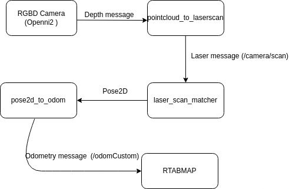
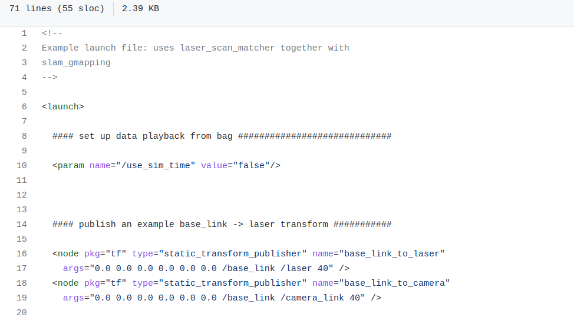
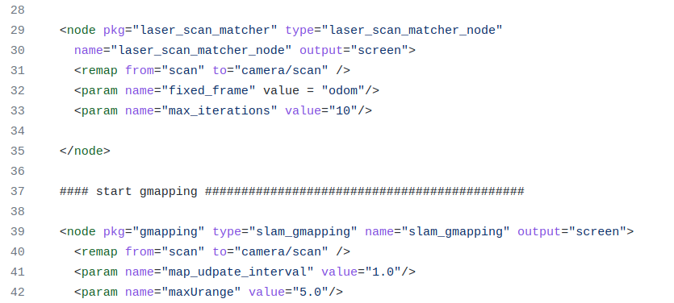

# rtabmap_ros_faster
RTAB-Map's ROS package.

Please make sure you have all the dependencies before you start. The dependencies above are for noetic-devel. 

!! For the fastest solution, you definetly need to use pointcloud_to_laserscan  and pose2d_to_odom packages in this project. Please do not try to get it externally!!

## Principle of Work

The package use 2D lidar odometry to localize, so if you are only using an RGBD Camera as sensor, you first need to obtain a laser message and then obtain an odometry with this laser message.

Here is the diagram of packages.




## Important Changes With The Dependencies' Parameters

There are some parameters you need to change in order to work this package properly.


### laser_scan_matcher 

If you already have this package or you somehow you get it externally, please do the changes below.

in **/laser_scan_matcher/demo/demo_gmapping.launch**

make sure first lines looks like below.


and also you need to do this remaps **if your laser message named anything but "/scan"**



## Running Packages

Open the terminal and run the command below 

```
$ roslaunch pointcloud_to_laserscan cob4_test_launch_node.launch 

```

Open another terminal and run the command

```
$ roslaunch laser_scan_matcher demo_gmapping.launch 

```

Open another terminal and run the command

```
$ roslaunch pose2d_to_odom start.launch

```
And finally run the command 

```
$ roslaunch rtabmap_ros rtabmap.launch 

```
Now you are ready to go ...


## Sample Mapping 

[](https://youtube.com/watch?v=PkO3fUO6CCg)
